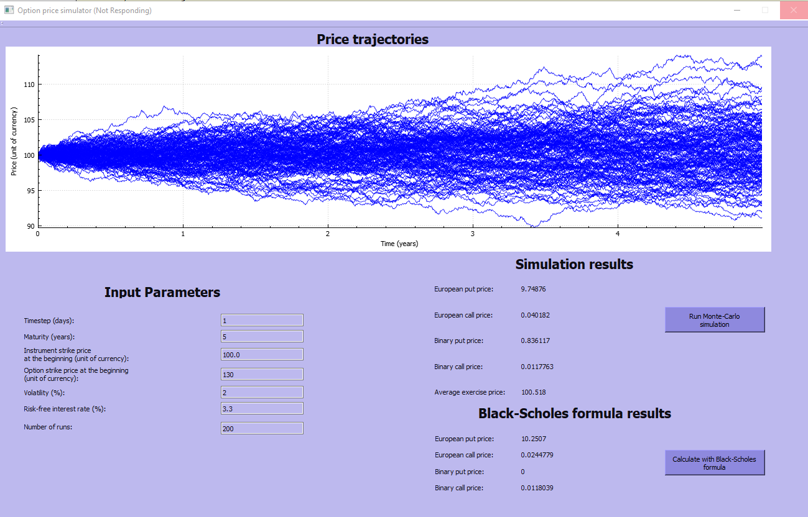

<html>
<h1>Derivatives' valuator</h1>

Find the price for European Calls, European Puts and Binary Calls and Puts with a Monte Carlo simulation or with the Black-Scholes -algorithm. Both can be done at the same time to be able to evaluate the results side-by-side.

The inspiration for this project stems from a finance course in the university where a similar tool was created in Excel with VBA.

Screenshot:

In the Monte Carlo simulation the price evolution trajectories are found by randomly sampling normal distribution. The value of the derivative is found by discounting the price of each trajectory to the present and then averaging all simulated and discounted prices. It is assumed in the simulation that the constant drift &mu; &#61; 0.5&sigma;&sup2;.

An important part of the code is the calculation of the inverse normal distribution based on a probability, mean and standard deviation. The code for that purpose was originally found <a href="https://stackoverflow.com/questions/2901750/is-there-a-c-sharp-library-that-will-perform-the-excel-norminv-function">here</a>.

<h3>Created with QT framework and C++.</h3>

</html>